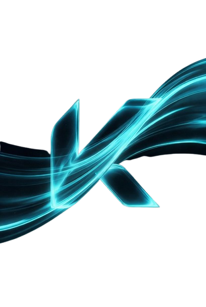

  
  <h1>Kinetic IDE — Sovereign Master Public Record</h1>
  
<strong>Intelligence Without Surveillance</strong>

  
  
  
  

  <h4>This repository serves as the authoritative public record of engineering velocity and architectural milestones for the Kinetic IDE core project.</h4>
  
  ---
  
  ### **[Explore the Live Engineering Pulse →](./DAILY_LOG.md)**

  *Tracking 140+ sessions of autonomous sovereign development.*

---

## ⚡ The Sovereign Mission: Freedom from Surveillance

Kinetic IDE is not just a tool; it is a **Statement of Sovereignty.** Built as a security-hardened fork of the modern development environment, Kinetic re-engineers the "AI Assistant" from a cloud-dependent liability into a hardware-sealed asset.

While legacy AI tools trade your intellectual property for autocomplete speed, Kinetic achieves **Intelligence Without Surveillance** by sealing its Agentic Brain behind native Nitro Enclaves and local Rust-powered orchestration.

---

## 🛡️ The Sovereign Advantage

Kinetic IDE is architected for elite developers who demand intelligence without exposure.

*   **Sealed Context**: 100% local-first orchestration via Rust and Nitro Enclaves. Your code never leaves your hardware.
*   **Zero-Latency Intelligence**: Real-time pattern discovery and code execution via the Neural Pulse telemetry stream.
*   **Universal Tool Registry**: A sovereign ecosystem of 79+ specialized agentic tools for full-spectrum automation.

---

## 🏗️ The Nervous System: High-Fidelity Orchestration

The Kinetic IDE core is powered by a multi-layered agentic engine designed for enterprise-grade stability and autonomous task execution.

### **The Four Pillars of Sovereignty**

| Layer | Component | Function |
| :--- | :--- | :--- |
| **L01** | **The Sentry Gate** | A zero-trust security sandbox that intercepts and validates every system-level action before execution. |
| **L02** | **Neural Pulse Engine** | A real-time telemetry stream that broadcasts agent thought processes and filesystem state to the UI. |
| **L03** | **Sovereign Orchestration** | A high-performance Rust core that manages complex, multi-file task plans with local-first context. |
| **L04** | **The Vision Matrix** | Multimodal intelligence for UI verification, architectural mapping, and visual debugging. |

---

## 🔬 Enterprise Progress: The Convergence Roadmap

We are currently executing the **Sovereign Convergence Plan**, a series of architectural milestones to achieve true agentic autonomy.

| Phase | Milestone | Status |
| :--- | :--- | :--- |
| **Phase 1** | **Memory Restoral (Context Persistence)** | `STABILIZED` |
| **Phase 2** | **Autonomous Initialization** | `PLANNED` |
| **Phase 3** | **Sensory Discovery (Grep/List)** | `DEPLOYED` |
| **Phase 4** | **Signal Convergence** | `PLANNED` |
| **Phase 5** | **The Vision Matrix (Multimodal)** | `PLANNED` |

---

## 📁 Repository Structure

As a **Master Public Record**, this repository tracks the evolution of the IDE without exposing proprietary source code.

- **`/public`**: Branding assets, hi-res logos, and architectural diagrams.
- **`DAILY_LOG.md`**: The definitive record of engineering velocity, updated every session (140+ sessions logged).
- **`TECH_LOG.md`**: *[COMING SOON]* Specialized technical audits and performance benchmarks.

---

## 🛡️ License & Copyright

All architectural designs, branding, and logic descriptions documented herein are **Proprietary**. Copyright © 2026 **Kinetic Tech Solution LLC**. All rights reserved.

---

  Built with Sovereignty by the Kinetic Team.

