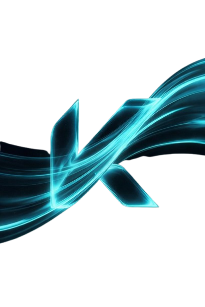

  
  <h1>Kinetic IDE — Enterprise Engineering Record</h1>
  
<strong>Intelligence Without Surveillance</strong>

  
  
  
  
  

  <h4>The authoritative public record of engineering velocity, architectural milestones, and production readiness for the Kinetic IDE platform.</h4>

  
Kinetic IDE is a proprietary product of <strong>Alayra Systems LLC</strong> (United States) and <strong>Alayra Systems Pvt Limited</strong> (Pakistan).

  ---

  ### **[Explore the Live Engineering Pulse →](./DAILY_LOG.md)**

  *191+ sessions of continuous sovereign development — February through June 2026.*

---

## Enterprise Positioning

Kinetic IDE is a **security-hardened, agentic development environment** built for organizations that require AI-assisted engineering without surrendering intellectual property, credentials, or execution telemetry to third-party clouds.

This repository is the **Master Public Record**: it documents product evolution, convergence milestones, and operational maturity **without exposing proprietary source code, internal file structures, or security implementation details.**

| Capability | Enterprise Value |
| :--- | :--- |
| **Local-First Orchestration** | Agent reasoning, tool execution, and semantic indexing run on developer hardware — not shared inference pools. |
| **Zero-Trust Execution Gate** | Every destructive or system-level action passes through a just-in-time approval pipeline with session-scoped trust. |
| **Universal Tool Registry** | 79+ specialized agentic tools with lane-aware policy enforcement for Ask, Plan, Code, and Vision workflows. |
| **Neural Pulse Telemetry** | Real-time execution visibility — thinking steps, file writes, commands, and mission traces — without external observability vendors. |
| **Bring-Your-Own-Key (BYOK)** | Connect private inference endpoints with curated model registry validation and context budget governance. |
| **Cross-Platform CI** | Automated build validation across Windows, macOS, and Linux for reproducible enterprise deployment. |

---

## The Sovereign Mission

Legacy AI assistants optimize for speed by routing code context through cloud inference. Kinetic inverts that tradeoff: **intelligence is delivered locally**, credentials remain vault-isolated, and the agentic brain operates behind Rust-native orchestration with hardware-sealed deployment options.

Kinetic achieves **Intelligence Without Surveillance** — enterprise-grade agentic automation with sovereign data boundaries.

---

## The Nervous System: Four Pillars

| Layer | Component | Function |
| :--- | :--- | :--- |
| **L01** | **The Sentry Gate** | Zero-trust sandbox intercepting and validating every system-level action before execution. |
| **L02** | **Neural Pulse Engine** | Real-time telemetry broadcasting agent thought processes, execution steps, and filesystem state to the UI. |
| **L03** | **Sovereign Orchestration** | High-performance Rust core managing multi-file task plans with local-first context and turn correlation. |
| **L04** | **The Vision Matrix** | Multimodal intelligence for UI verification, architectural mapping, and visual debugging. |

---

## Sovereign Convergence Roadmap

The platform is executing a phased convergence plan toward full agentic autonomy. Current status as of June 2026:

| Phase | Milestone | Status |
| :--- | :--- | :--- |
| **Phase 1** | **Memory Restoral (Context Persistence)** | `STABILIZED` |
| **Phase 2** | **Autonomous Initialization** | `IN PROGRESS` |
| **Phase 3** | **Sensory Discovery (Grep/List/Index)** | `DEPLOYED` |
| **Phase 4** | **Signal Convergence (Pulse Lifecycle)** | `DEPLOYED` |
| **Phase 5** | **The Vision Matrix (Multimodal)** | `DEPLOYED` |
| **Phase 6** | **Production UX & Orchestration Maturity** | `IN PROGRESS` |
| **Phase 7** | **Enterprise Contact & Admin Pipeline** | `DEPLOYED` |

Detailed session-by-session progress is maintained in the **[Daily Engineering Pulse →](./DAILY_LOG.md)**.

---

## Production Maturity Highlights

Recent convergence work (April–June 2026) delivered:

- **Theme system** — Carbon, Lumen, and Glass workbench identities with OS-aware defaults
- **Credential vault isolation** — API keys never pollute shared process environment
- **Pulse Archive** — Cross-platform session history with approval-scoped forensic traces
- **Blueprint approval gate** — Architectural review workflow before autonomous Code execution
- **Indexing sovereignty** — Enterprise-grade workspace indexing with GraphRAG observability
- **Mission Command Center** — High-level orchestration dashboard with mature chat turn UX
- **Orchestration coherence** — Timeout recovery, pulse fidelity, and execution summary honesty

---

## Repository Structure

| Path | Purpose |
| :--- | :--- |
| **`/public`** | Branding assets, logos, and architectural diagrams |
| **`DAILY_LOG.md`** | Definitive engineering velocity record (191+ sessions, Feb–Jun 2026) |
| **`LICENSE.txt`** | Proprietary license terms (Alayra Systems entities) |
| **`.github/ISSUE_TEMPLATE`** | Community issue templates for public feedback |

---

## Trust & Compliance Posture

- **Proprietary architecture** — All designs, orchestration logic descriptions, and branding documented herein are confidential to **Alayra Systems LLC** and **Alayra Systems Pvt Limited**.
- **No source exposure** — This repository intentionally excludes the IDE core, engine binaries, extension source trees, and operational API handlers.
- **Audit-grade logging** — Enterprise opt-in forensic logging and Pulse Trace sidecars support internal compliance review without third-party telemetry dependencies.

---

## License & Copyright

All architectural designs, branding, and logic descriptions documented herein are **Proprietary**.

Kinetic IDE and all Kinetic-branded products are proprietary products of **Alayra Systems LLC** (United States) and **Alayra Systems Pvt Limited** (Pakistan).

Copyright © 2026 Alayra Systems LLC · Alayra Systems Pvt Limited. All rights reserved.

---

  Built with Sovereignty by the Kinetic Team — an Alayra Systems product line.

